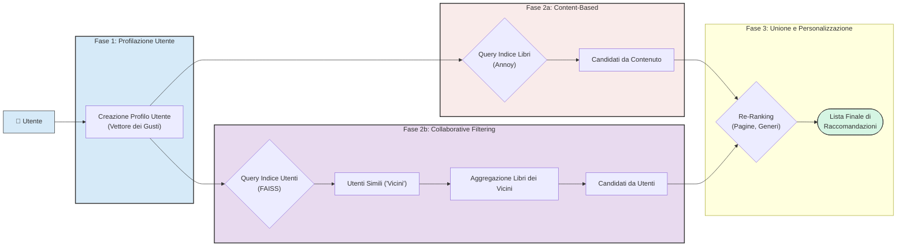

MERMAID, prima di modificare (sotto)

---

```mermaid
---

config:

layout: dagre

---

flowchart LR

subgraph PROFILAZIONE["Fase 1: Profilazione Utente"]

B["Creazione Profilo Utente<br>(Vettore dei Gusti)"]

end

subgraph CB["Fase 2a: Content-Based"]

C{"Query Indice Libri<br>(Annoy)"}

E["Candidati da Contenuto"]

end

subgraph CF["Fase 2b: Collaborative Filtering"]

D{"Query Indice Utenti<br>(FAISS)"}

F@{ label: "Utenti Simili ('Vicini')" }

G["Aggregazione Libri dei Vicini"]

H["Candidati da Utenti"]

end

subgraph FASE["Fase 3: Unione e Personalizzazione"]

I{"Re-Ranking<br>+ Filtri (Pagine, Generi)"}

J(["Lista Finale di<br>Raccomandazioni"])

end

subgraph FASE["Fase 3: Unione e Personalizzazione"]

I{"Re-Ranking<br> (Pagine, Generi)"}

J(["Lista Finale di<br>Raccomandazioni"])

end

A["👤 Utente"] --> B

B --> C & D

C --> E

D --> F

F --> G

G --> H

E --> I

H --> I

I --> J

F@{ shape: rect}

style J fill:#D5F5E3,stroke:#333

style A fill:#D6EAF8,stroke:#333

style PROFILAZIONE fill:#D6EAF8,stroke:#333,stroke-width:2px

style CB fill:#F9EBEA,stroke:#333,stroke-width:2px

style CF fill:#E8DAEF,stroke:#333,stroke-width:2px

style FASE fill:#FCF3CF,stroke:#333,stroke-width:2px
```