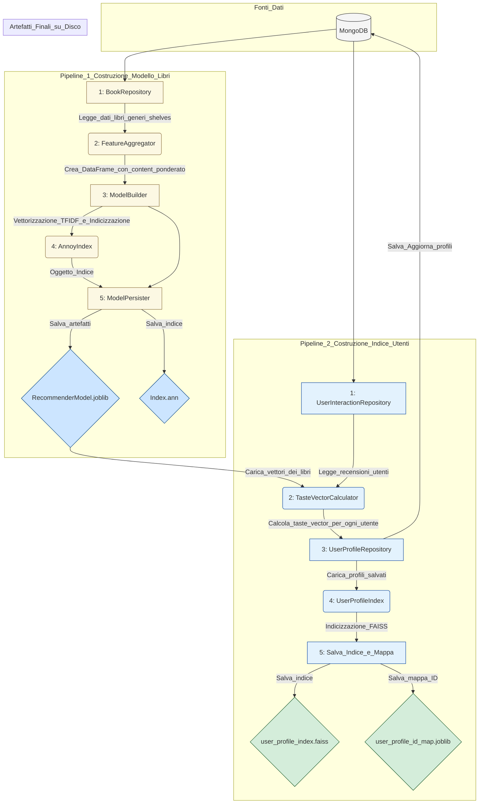

```mermaid
---

config:

layout: dagre

---

flowchart TD

subgraph Fonti_Dati["Fonti_Dati"]

mongo_db[("MongoDB")]

end

subgraph Pipeline_1_Costruzione_Modello_Libri["Pipeline_1_Costruzione_Modello_Libri"]

B1("2: FeatureAggregator")

A1["1: BookRepository"]

C1["3: ModelBuilder"]

D1("4: AnnoyIndex")

E1["5: ModelPersister"]

F1{"RecommenderModel.joblib"}

G1{"Index.ann"}

end

subgraph Pipeline_2_Costruzione_Indice_Utenti["Pipeline_2_Costruzione_Indice_Utenti"]

B2("2: TasteVectorCalculator")

A2["1: UserInteractionRepository"]

C2["3: UserProfileRepository"]

D2("4: UserProfileIndex")

E2["5: Salva_Indice_e_Mappa"]

H2{"user_profile_index.faiss"}

I2{"user_profile_id_map.joblib"}

end

subgraph Artefatti_Finali_su_Disco["Artefatti_Finali_su_Disco"]

end

A1 -- Legge_dati_libri_generi_shelves --> B1

B1 -- Crea_DataFrame_con_content_ponderato --> C1

C1 -- Vettorizzazione_TFIDF_e_Indicizzazione --> D1

C1 --> E1

D1 -- Oggetto_Indice --> E1

E1 -- Salva_artefatti --> F1

E1 -- Salva_indice --> G1

A2 -- Legge_recensioni_utenti --> B2

F1 -- Carica_vettori_dei_libri --> B2

B2 -- Calcola_taste_vector_per_ogni_utente --> C2

C2 -- Salva_Aggiorna_profili --> mongo_db

C2 -- Carica_profili_salvati --> D2

D2 -- Indicizzazione_FAISS --> E2

E2 -- Salva_indice --> H2

E2 -- Salva_mappa_ID --> I2

mongo_db --> A1 & A2

mongo_db:::datastore

B1:::pipeline1

A1:::pipeline1

C1:::pipeline1

D1:::pipeline1

E1:::pipeline1

B2:::pipeline2

A2:::pipeline2

C2:::pipeline2

D2:::pipeline2

E2:::pipeline2

classDef pipeline1 fill:#fcf8e3,stroke:#8a6d3b

classDef pipeline2 fill:#e3f2fd,stroke:#0d47a1

classDef datastore fill:#f5f5f5,stroke:#333

style F1 fill:#cce5ff,stroke:#004085

style G1 fill:#cce5ff,stroke:#004085

style H2 fill:#d4edda,stroke:#155724

style I2 fill:#d4edda,stroke:#155724
```