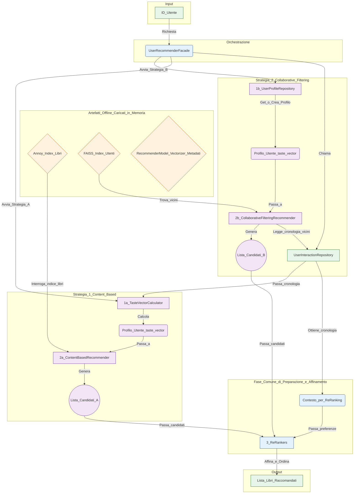

```mermaid
---

config:

layout: dagre

---

flowchart TB

subgraph Input["Input"]

user_id["ID_Utente"]

end

subgraph Artefatti_Offline_Caricati_in_Memoria["Artefatti_Offline_Caricati_in_Memoria"]

direction LR

annoy_index{"Annoy_Index_Libri"}

faiss_index{"FAISS_Index_Utenti"}

model_joblib{"RecommenderModel_Vectorizer_Metadati"}

end

subgraph Orchestrazione["Orchestrazione"]

direction TB

facade("UserRecommenderFacade")

end

subgraph Strategia_1_Content_Based["Strategia_1_Content_Based"]

direction TB

B1("Profilo_Utente_taste_vector")

A1["1a_TasteVectorCalculator"]

C1["2a_ContentBasedRecommender"]

D1(("Lista_Candidati_A"))

end

subgraph Strategia_2_Collaborative_Filtering["Strategia_2_Collaborative_Filtering"]

direction TB

B2("Profilo_Utente_taste_vector")

A2["1b_UserProfileRepository"]

C2["2b_CollaborativeFilteringRecommender"]

user_repo["UserInteractionRepository"]

D2(("Lista_Candidati_B"))

end

subgraph Fase_Comune_di_Preparazione_e_Affinamento["Fase_Comune_di_Preparazione_e_Affinamento"]

direction TB

prepare_context("Contesto_per_ReRanking")

reranker["3_ReRankers"]

end

subgraph Output["Output"]

direction TB

output["Lista_Libri_Raccomandati"]

end

A1 -- Calcola --> B1

B1 -- Passa_a --> C1

annoy_index -- Interroga_indice_libri --> C1

C1 -- Genera --> D1

A2 -- Get_o_Crea_Profilo --> B2

B2 -- Passa_a --> C2

faiss_index -- Trova_vicini --> C2

C2 -- Legge_cronologia_vicini --> user_repo

C2 -- Genera --> D2

user_repo -- Ottiene_cronologia --> prepare_context

prepare_context -- Passa_preferenze --> reranker

user_id -- Richiesta --> facade

facade -- Chiama --> user_repo

facade -- Avvia_Strategia_A --> A1

user_repo -- Passa_cronologia --> A1

facade -- Avvia_Strategia_B --> A2

D1 -- Passa_candidati --> reranker

D2 -- Passa_candidati --> reranker

reranker -- Affina_e_Ordina --> output

user_id:::data

annoy_index:::artifact

faiss_index:::artifact

model_joblib:::artifact

facade:::process

B1:::strategy

A1:::strategy

C1:::strategy

D1:::strategy

B2:::strategy

A2:::strategy

C2:::strategy

user_repo:::data

D2:::strategy

prepare_context:::process

reranker:::process

output:::data

classDef process fill:#e3f2fd,stroke:#0d47a1

classDef strategy fill:#f3e5f5,stroke:#4a148c

classDef data fill:#e8f5e9,stroke:#1b5e20

classDef artifact fill:#fff3e0,stroke:#e65100
```